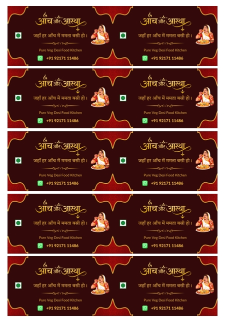

# Visiting Card Duplex Printing (A4)

A Python utility that takes front and back visiting card images and generates a **two-page A4 PDF** with:
- Maximum number of cards per sheet
- Perfect front–back alignment
- Straight (non-mirrored) back side
- Print-ready layout for manual or duplex printing

Designed for real-world print-and-cut workflows.

---

## Features

- Automatically fits **maximum visiting cards on A4**
- Front side on Page 1, Back side on Page 2
- Exact positional alignment for accurate cutting
- Supports high-quality print (300 DPI)
- No image distortion (aspect ratio preserved)
- Works with JPEG/JPG card designs

---

## Visiting Card Size Used

- **8.7 cm × 5.2 cm**  
  (Standard, balanced, not overly rectangular)

Converted internally using DPI-safe pixel math.

---

## Print Recommendation

- Paper: A4 (210 × 297 mm)
- DPI: **300 DPI** (best balance of quality and file size)
- Print mode:  
  - Duplex supported → use duplex  
  - Duplex not supported → manual flip (long edge)

---

## 📄 Sample Output



---

## Input Files

- `front.jpg` — front side of the card  
- `back.jpg` — back side of the card  

Both images should have the **same dimensions**.

---

## ▶ How to Run

```bash
python visiting_card_pdf.py front.jpg back.jpg output.pdf
